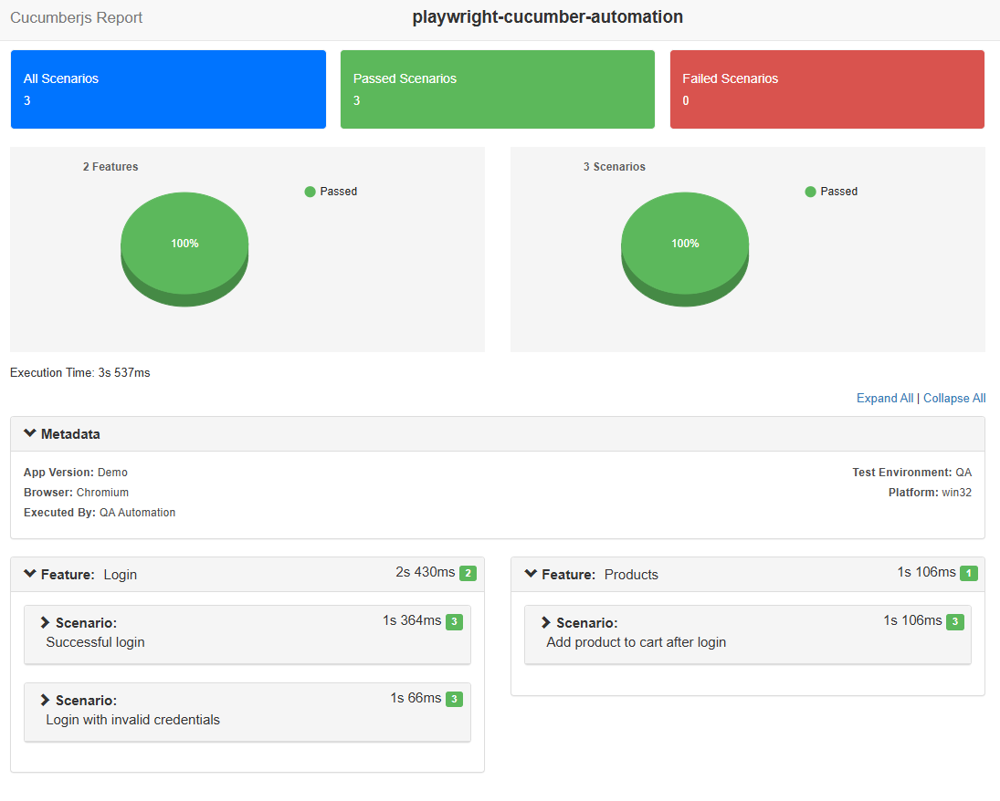

# QA Automation Framework – Playwright + Cucumber

## Overview

This repository contains a production-ready test automation framework built using **Playwright**, **TypeScript**, and **Cucumber (BDD)**.
The framework demonstrates clean test architecture, maintainable structure, and end-to-end automation of core user flows for a web application.

This project was created as part of a **QA Automation Engineer – Technical Assignment (Stage 2)**.

---

## Technology Stack

* **Playwright** – Browser automation
* **TypeScript** – Strong typing and maintainability
* **Cucumber (BDD)** – Business-readable test scenarios
* **Node.js / npm** – Dependency management

---

## Application Under Test

**Sauce Demo**
[https://www.saucedemo.com](https://www.saucedemo.com)

The application provides:

* User authentication (login)
* Post-login product interactions

---

## Project Setup Instructions

### Prerequisites

* Node.js (v18 or higher)
* npm

### Installation

Clone the repository and install dependencies.
The `node_modules` directory is intentionally **not committed** to source control and will be installed locally using npm.

```bash
npm install
```

---

## Environment Setup

Sensitive configuration values are not committed to the repository.

### Steps

1. Create a `.env` file in the project root.
2. Use the provided `.env.example` file as a reference.

Example:

```env
BASE_URL=https://www.saucedemo.com
APP_USERNAME=standard_user
APP_PASSWORD=secret_sauce
INVALID_USERNAME=locked_out_user
INVALID_PASSWORD=wrong_password
```

> Note: The `.env` file is excluded from version control.
> This is a standard practice to avoid committing environment-specific or sensitive data.

---

## How to Run the Tests

### To Run all tests 
```bash
npm test
```


## Test Reports

After executing the tests, generate the HTML report:

```bash
npm run report
```

The report will be generated at:

```
reports/cucumber-report.html
```
## Sample Test Report

Below is a sample HTML report generated after test execution:



The report provides:
- Feature and scenario execution status
- Step-level results
- Execution time and failure details
---

## Framework Structure (High-Level)

```text
features/              → Gherkin feature files (BDD scenarios)
src/
  ├── pages/            → Page Object Model (UI interactions)
  ├── steps/            → Cucumber step definitions
  ├── hooks/            → Test lifecycle hooks
  ├── config/           → Browser & environment configuration
  └── utils/            → Shared utilities and custom World
scripts/               → Report generation scripts
```

### Design Highlights

* **Cucumber** is used as the test runner for BDD-style scenarios
* **Playwright** is used purely as the automation engine
* **Page Object Model (POM)** ensures separation of test logic and UI logic
* Environment variables are used to avoid hardcoded configuration
* The framework is designed to scale as additional scenarios are added

---

## Automated Scenarios

* Successful login
* Login with invalid credentials
* Add product to cart after login

All scenarios are written in **Gherkin** and validated with meaningful assertions.

---

## Assumptions & Simplifications

* Only **Chromium** browser is supported (as required)
* A publicly available demo application is used
* Authentication is performed via UI (no API session reuse)
* Single environment configuration
* Basic HTML reporting (JSON → HTML) for clarity

---

## Notes

The framework intentionally prioritizes:

* Code clarity
* Maintainability
* Stable and readable tests
* Clean architectural decisions

Additional enhancements such as CI integration, parallel execution, or screenshots on failure can be added easily if required.

---

## Author

Aslitha

